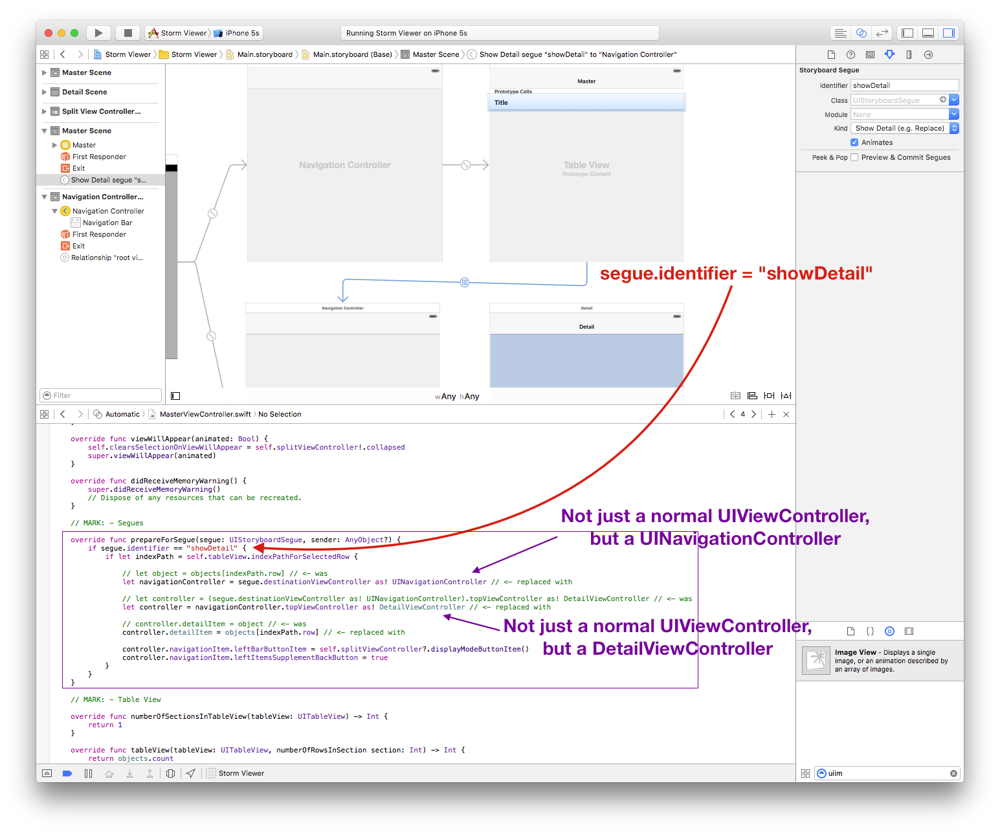
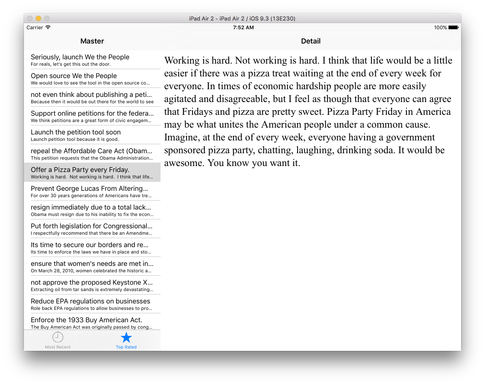

# [Tutorial 6b: Auto Layout](https://www.hackingwithswift.com/read/6/overview)

Get to grips with Auto Layout using practical examples, code and Auto Layout Visual Format Language (VFL).

## Steps

```swift
// ViewController.swift

// ...
    let label1 = UILabel()
    label1.translatesAutoresizingMaskIntoConstraints = false // By default iOS generates Auto Layout constraints for you based on a view's size and position. We'll be doing it by hand, so we need to disable this feature.

// ...
    view.addSubview(label1)

// ...
override func prefersStatusBarHidden() -> Bool {
    return true
}
```

> If you run the app now, you'll see seem some colorful labels at the top, overlapping so it looks like it says "LABELS ME". That's because our labels are placed in their default position (at the top-left of the screen) and are all sized to fit their content.

[Click for full size](https://raw.githubusercontent.com/dlcmh/ios-playground/hws-06b-auto-layout/1.png)<br>


Horizontal VFL:

```swift
let viewsDictionary = ["label1": label1, "label2": label2,
                       "label3": label3, "label4": label4,
                       "label5": label5]
for label in viewsDictionary.keys {
    view.addConstraints(NSLayoutConstraint.constraintsWithVisualFormat("H:|[\(label)]|", options: [], metrics: nil, views: viewsDictionary))
```

[Click for full size](https://raw.githubusercontent.com/dlcmh/ios-playground/hws-06b-auto-layout/2.png)<br>


Vertical VFL:

```swift
view.addConstraints(NSLayoutConstraint.constraintsWithVisualFormat("V:|[label1]-[label2]-[label3]-[label4]-[label5]", options: [], metrics: nil, views: viewsDictionary))
```

[Click for full size](https://raw.githubusercontent.com/dlcmh/ios-playground/hws-06b-auto-layout/3.png)<br>

