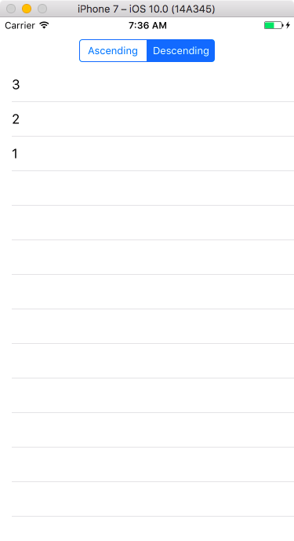

# [Tutorial 1: Storm Viewer - Constants and variables, UITableView, UIImageView, NSFileManager, storyboards](https://www.hackingwithswift.com/read/1/overview)

Scroll a list of images, and select one to view.

- constants and variables
- arrays
- method overrides
- typecasting
- optionals

- Interface Builder
- Storyboards
- Auto Layout

`UINavigationController` view controller: has `hidesBarsOnTap` property - When this is set to true, the user can tap anywhere on the current view controller to hide the navigation bar, then tap again to show it. Be warned: you need to set it carefully when working with iPhones. If we had it set on all the time then it would affect taps in the table view, which would cause havoc when the user tried to select things. So, we need to enable it when showing the detail view controller, then disable it when hiding. `viewDidLoad()` is called when the view controller's layout has been loaded. There are several others that get called when the view is about to be shown, when it has been shown, when it's about to go away, and when it has gone away. These are called, respectively, `viewWillAppear()`, `viewDidAppear()`, `viewWillDisappear()` and `viewDidDisappear()`. Use `viewWillAppear()` and `viewWillDisappear()` to modify the `hidesBarsOnTap` property so that it's set to true only when the detail view controller is showing. All view controllers have an optional property called `navigationController`, which, if set, lets us reference the navigation controller we are inside. It's optional because not all view controllers are inside a navigation controller. In Swift you can use a question mark inside a statement to evaluate an optional, and execution of the line will continue only if the optional could be unwrapped. So, if we're not inside a navigation controller, the `hidesBarsOnTap` lines will do nothing.

- UITableView, table views
- UIImageView, image views
- outlets

- app bundles

`NSFileManager`, `NSBundle`

- loops


# Steps

Delete all lines after `super.viewDidLoad()` line in `func viewDidLoad()` method.

Delete `func insertNewObject()` method

Delete `tableView(_:commitEditingStyle:forRowAtIndexPath:)` method (aka `commitEditingStyle` method for short)

Remove `as! NSDate` and `.description` from `cellForRowAtIndexPath` method.

Remove `as! NSDate` from `prepareForSegue()` method.

Retrieving file names with `NSFileManager`:

```swift
let fm = NSFileManager.defaultManager() // `NSFileManager.defaultManager()` is a type that lets us work with the filesystem
let path = NSBundle.mainBundle().resourcePath! // `NSBundle.mainBundle().resourcePath!` is the resource path of our app's bundle - a bundle is a directory containing our compiled program and all our assets
let items = try! fm.contentsOfDirectoryAtPath(path) // The try! keyword is not used frequently, but we're using it here to mean "I realise calling this code might fail, but I'm certain it won't." If the code does fail, our app will crash. At the same time, if the code fails it means our app can't read its own data, so something must be seriously wrong, which is why try! is OK here.

for item in items {
    if item.hasPrefix("nssl") {
        objects.append(item)
    }
}
```

[Click for full size](https://raw.githubusercontent.com/dlcmh/ios-playground/hws-01-storm-viewer/1.png)


Master segue to Detail

[Click for full size](https://raw.githubusercontent.com/dlcmh/ios-playground/hws-01-storm-viewer/2.png)

