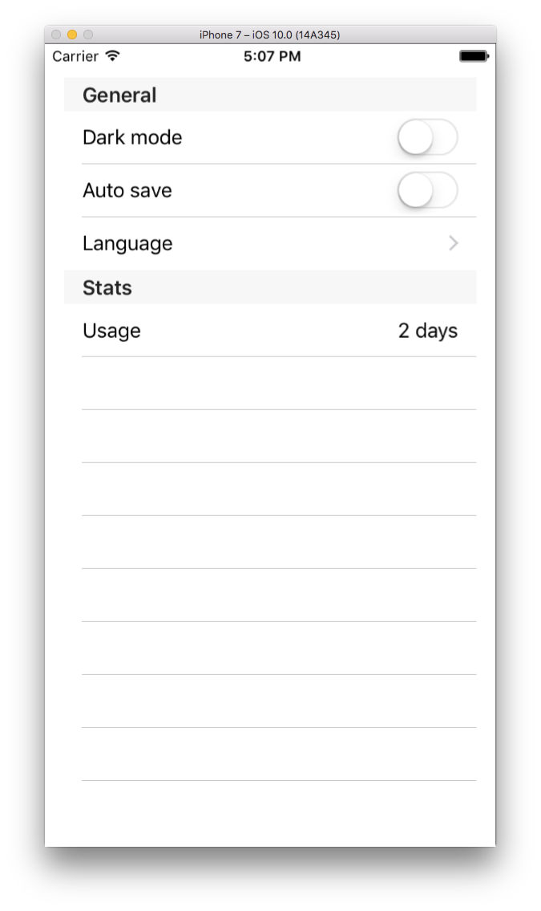
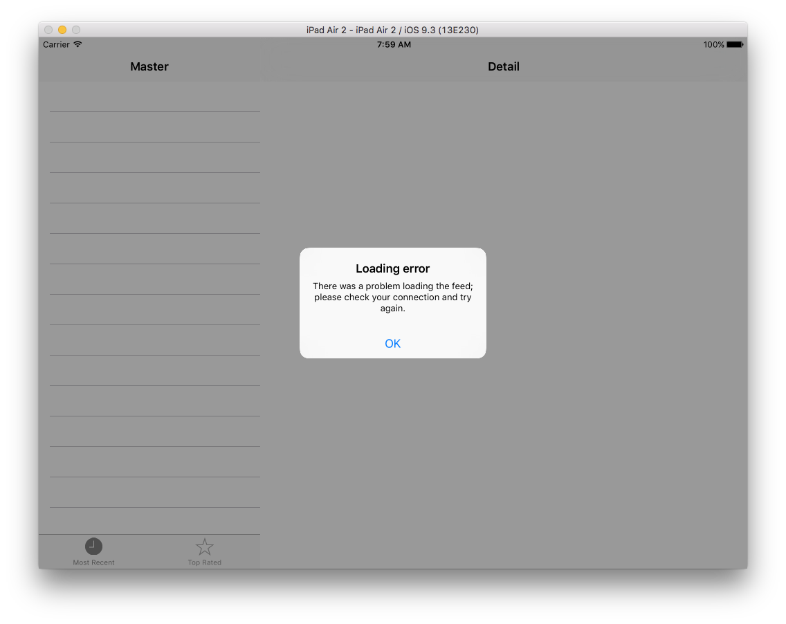

# [Project 7: Whitehouse Petitions: JSON and NSData – Overview – a free Hacking with Swift tutorial](https://www.hackingwithswift.com/read/7/overview)

Make an app to parse Whitehouse petitions using JSON and a tab bar.

SwiftyJSON: When you use arrayValue with SwiftyJSON, you either get back an __array of objects__ or an __empty array__, so we use the return value in our loop.

JSON, NSData:

> To download data and convert it to a SwiftyJSON object, we're going to use `NSURL` alongside a new NS class called `NSData`. This is a class designed to hold data in any form, which might be a string, it might be an image, or it might be something else entirely. You already saw that `NSString` can be created using `contentsOfFile` to load data from disk. Well, `NSData` (and `NSString`) can be created using `contentsOfURL`, which downloads data from a URL (specified using `NSURL`) and makes it available to you.

[Click for full size](https://raw.githubusercontent.com/dlcmh/ios-playground/hws-07-whitehouse-petitions/1.png)<br>


Render detail with `WKWebView` and `loadHTMLString`:

```swift
// DetailViewController.swift

import WebKit
import UIKit

class DetailViewController: UIViewController {

    var webView: WKWebView!
    var detailItem: [String: String]!

    override func loadView() {
        webView = WKWebView()
        view = webView
    }

    override func viewDidLoad() {
        super.viewDidLoad()

        guard detailItem != nil else { return }

        if let body = detailItem["body"] {
            var html = "<html>"
            html += "<head>"
            html += "<meta name =\"viewport\" content=\"width=device=width, initial-scale=1\">"
            html += "<style> body { font-size: 150% } </style>"
            html += "</head>"
            html += "<body>"
            html += body
            html += "</body>"
            html += "</html>"
            webView.loadHTMLString(html, baseURL: nil)
        }

    }

}
```

[Click for full size](https://raw.githubusercontent.com/dlcmh/ios-playground/hws-07-whitehouse-petitions/2.png)<br>


Write code inside the `didFinishLaunching` method of `AppDelegate.swift` for dynamically inserting a second `MasterViewController` into the `UITabBar`.

> If you add more view controllers to the tab bar, you'll find you can add up to five before you start seeing a "More" button. This More tab hides all the view controllers that don't fit into the tab bar, and it's handled for you automatically by iOS.

[Click for full size](https://raw.githubusercontent.com/dlcmh/ios-playground/hws-07-whitehouse-petitions/3.png)<br>


Display aloading error message inside a `UIAlertController` with a `UIAlertAction` button to dismiss the alert.

[Click for full size](https://raw.githubusercontent.com/dlcmh/ios-playground/hws-07-whitehouse-petitions/4.png)<br>

